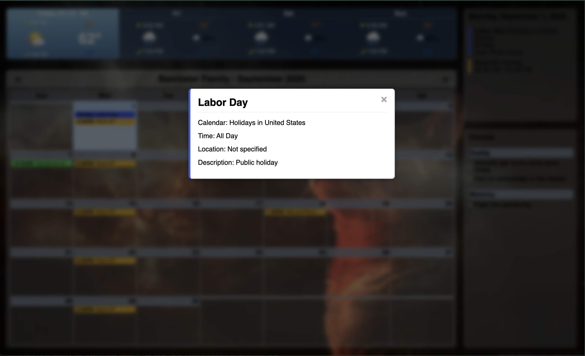

# Family Calendar & Photo Slideshow

A wall-mounted family calendar and photo slideshow application designed to run on a Raspberry Pi with a touchscreen monitor, built with Flask and JavaScript.




## Description

This open source project provides families with an interactive digital calendar and photo slideshow system that can be mounted in common areas of your home. It integrates with Google Calendar and Google Tasks, displays weather information, and transforms into a photo slideshow during periods of inactivity.

## Features

### Calendar Functionality
- **Interactive Monthly Calendar**: Displays a full month with color-coded events on the left side of the screen
- **Daily Schedule View**: Shows hourly breakdown of the current day's activities on the right side
- **Google Calendar Integration**: 
  - Automatic background syncing of calendar events
  - Support for multiple calendars with color coding
  - Proper handling of all-day events and recurring events
- **Google Tasks Integration**:
  - Display of tasks/chores from Google Tasks
  - Background synchronization to keep tasks up to date
- **Smart Activity Detection**:
  - Detects user interaction via touch, mouse, and keyboard
  - **PIR Motion Sensor Integration**: Automatically detects motion and wakes display
  - Automatically switches between active and inactive modes
  - Different timeout settings for day and night

### Motion Detection & Power Management
- **PIR Sensor Integration**:
  - Connects to GPIO pin 18 on Raspberry Pi 5
  - Real-time motion detection with configurable sensitivity
  - Automatic display wake-up when people approach
  - Debounce protection to prevent false triggers
- **Intelligent Power Saving**:
  - Automatic dimming during inactivity periods
  - PIR sensor disrupts inactivity timers instantly
  - Different brightness levels for day and night modes
  - Seamless transition between sleep and active states

### Weather Integration
- **Current Weather Display**: 
  - Shows current temperature and conditions
  - Displays appropriate weather icons
- **Weather Forecast**: 
  - Multi-day weather forecast
  - Regular background updates
- **Offline Support**:
  - Intelligent caching with 24-hour retention
  - Graceful degradation when internet is unavailable
  - Automatic recovery when connection is restored

### Photo Slideshow Functionality
- **Adaptive Inactivity Modes**:
  - Day mode with reduced brightness
  - Night mode with further reduced brightness
  - Long inactivity mode that activates the slideshow
- **Smart Photo Management**:
  - Automatic detection and indexing of photos in the photos directory
  - Random photo selection for slideshow variety
  - SQLite database tracking for efficient photo management
- **Mobile Photo Upload System**:
  - **Secure QR Code Access**: Generate time-limited QR codes for mobile photo uploads
  - **Token-Based Security**: HMAC-SHA256 signed tokens with 60-minute expiration
  - **iPhone Compatibility**: Automatic HEIC to JPEG conversion for iPhone photos
  - **Rate Limiting**: 10 uploads per minute, 100 per hour per device/token
  - **Multi-format Support**: JPG, PNG, HEIC, WebP, GIF formats up to 16MB each
  - **Automatic Processing**: Image optimization, resizing, and thumbnail generation
  - **Mobile-Optimized Interface**: Touch-friendly upload interface with progress tracking
- **Smooth Transitions**: Fade transitions between calendar view and photos

### System Features
- **Flask Web Application**: 
  - Python backend with Flask routing
  - Modular JavaScript frontend
- **Responsive Design**: Adapts to different monitor sizes and is optimized for touchscreen use
- **Enhanced Touchscreen Experience**: 
  - Hidden mouse cursor for touch-only interaction
  - Advanced virtual keyboard with haptic feedback and multiple layouts
  - Touch-optimized UI components with visual feedback
  - Long-press support for rapid text deletion
- **Smart Loading & Feedback**:
  - Visual loading indicators with toast notifications
  - Offline mode with intelligent caching for weather data
  - Real-time sync status indicators
  - Motion detection visual feedback with ripple effects
- **Hardware Integration**:
  - PIR motion sensor support via GPIO with visual status indicators
  - Automatic fallback to simulation mode for development
  - Real-time sensor communication via Server-Sent Events
- **Configuration Management**:
  - Centralized configuration system with config.json
  - Environment variable support for backwards compatibility
  - Auto-generation of default configurations
  - Production vs development mode handling
- **Energy Efficiency**:
  - Power-saving modes during periods of inactivity
  - Motion-activated display wake-up
  - Different brightness levels based on time of day
- **Database-Backed**: SQLite databases for efficient data storage and retrieval
- **Background Processing**: 
  - Multi-threaded background tasks for syncing services
  - Thread-safe operations with proper locking mechanisms
  - Graceful error handling and recovery

## Technical Architecture

The application is built using the following technologies:

- **Backend**:
  - Python 3.13+
  - Flask web framework
  - SQLite databases
  - Threading for background operations
  - Google API clients

- **Frontend**:
  - HTML/CSS with responsive design
  - Modular JavaScript (ES6)
  - Component-based architecture
  
- **Modules**:
  - `calendar_app`: Core calendar functionality and database
  - `google_integration`: Google Calendar and Tasks API integration
  - `slideshow`: Photo management and display
  - `weather_integration`: Weather data fetching with offline caching
  - `pir_sensor`: PIR motion sensor integration and GPIO control
  - `photo_upload`: Secure mobile photo upload system with token authentication
  - `config`: Centralized configuration management system

## Installation

### Prerequisites
- Raspberry Pi 5 (4GB+ RAM recommended for optimal performance)
- PIR motion sensor (HC-SR501 or compatible)
- Touchscreen monitor with appropriate cables
- SD card (32GB+ recommended)
- Power supply for Raspberry Pi
- Internet connection
- Python 3.13+
- Google Cloud OAuth credentials

### Hardware Setup
1. **Connect PIR Sensor**:
   - Connect VCC to 5V pin (Pin 2 or 4)
   - Connect GND to Ground pin (Pin 6, 9, 14, 20, 25, 30, 34, or 39)
   - Connect OUT to GPIO 18 (Pin 12)
   - Ensure PIR sensor is positioned to detect motion in desired area

2. **Touchscreen Setup**:
   - Connect touchscreen via HDMI and USB
   - Ensure proper power supply for both Pi and display

### Automated Installation (Recommended)

We provide a deployment script that automates the installation and setup process:

1. **Download the script**:
   ```bash
   curl -O https://raw.githubusercontent.com/Rasheed-bannister/family_calendar/main/deploy_raspberry_pi.sh
   chmod +x deploy_raspberry_pi.sh
   ```

2. **Run the script with sudo**:
   ```bash
   sudo ./deploy_raspberry_pi.sh
   ```

The script will:
- Install all required dependencies
- Clone the repository
- Set up a Python virtual environment
- Configure autostart settings
- Set up the display for optimal performance
- Configure GPIO permissions for PIR sensor
- Guide you through adding Google API credentials
- Test PIR sensor functionality
- Offer to reboot when complete

### Manual Installation

If you prefer to install manually, follow these steps:

1. **Set up your Raspberry Pi**:
   ```bash
   # Download and install Raspberry Pi OS (64-bit)
   # Follow instructions at https://www.raspberrypi.org/software/
   ```

2. **Clone the repository**:
   ```bash
   git clone https://github.com/Rasheed-bannister/family_calendar.git
   cd family-calendar
   ```

3. **Install dependencies**:
   ```bash
   # Install UV package manager
   curl -sSf https://install.python-poetry.org | python3 -
   
   # Install project dependencies
   uv venv
   source .venv/bin/activate
   uv pip install -e .
   ```

4. **Set up Google API credentials**:
   1. Go to the [Google Cloud Console](https://console.cloud.google.com/)
   2. Create a new project
   3. Enable the Google Calendar API and Google Tasks API
   4. Create OAuth credentials (Desktop application type)
   5. Download the credentials.json file
   6. Place the file in the `src/google_integration/` directory

5. **Initialize the application**:
   ```bash
   # Run the application once to initialize databases and authenticate with Google
   # This will prompt you to authorize the application with your Google account
   uv run src/main.py
   ```

### Deploying on Raspberry Pi

1. **Configure GPIO permissions**:
   ```bash
   # Add user to gpio group for PIR sensor access
   sudo usermod -a -G gpio $USER
   
   # Set up GPIO permissions
   sudo chmod 666 /dev/gpiomem
   ```

2. **Test PIR sensor**:
   ```bash
   # Test PIR sensor connectivity
   cd family-calendar
   source .venv/bin/activate
   python -c "from src.pir_sensor.sensor import PIRSensor; sensor = PIRSensor(); print('GPIO available:', sensor.gpio_available)"
   ```

3. **Enable auto-start on boot**:
   ```bash
   mkdir -p ~/.config/autostart
   cat > ~/.config/autostart/calendar.desktop << EOF
   [Desktop Entry]
   Type=Application
   Name=Family Calendar
   Exec=/bin/bash -c "cd /path/to/family-calendar && source .venv/bin/activate && python src/main.py"
   X-GNOME-Autostart-enabled=true
   EOF
   ```

2. **Configure screen settings**:
   ```bash
   # Prevent screen from sleeping
   sudo apt-get install xscreensaver
   xscreensaver-command -exit
   ```

3. **Setup touchscreen calibration**:
   ```bash
   sudo apt-get install xinput-calibrator
   xinput_calibrator
   # Follow on-screen instructions
   ```

4. **Configure browser in kiosk mode**:
   ```bash
   # Install Chromium browser if not already installed
   sudo apt-get install chromium-browser
   
   # Create a script to launch in kiosk mode
   cat > ~/launch-calendar.sh << EOF
   #!/bin/bash
   # Start the Flask server in the background
   cd /path/to/family-calendar
   source .venv/bin/activate
   python src/main.py &
   
   # Wait for server to start
   sleep 5
   
   # Launch Chromium in kiosk mode
   chromium-browser --kiosk --incognito --disable-pinch --overscroll-history-navigation=0 http://localhost:5000
   EOF
   
   chmod +x ~/launch-calendar.sh
   ```

5. **Add the script to autostart**:
   ```bash
   cat > ~/.config/autostart/calendar-kiosk.desktop << EOF
   [Desktop Entry]
   Type=Application
   Name=Calendar Kiosk
   Exec=/bin/bash /home/pi/launch-calendar.sh
   X-GNOME-Autostart-enabled=true
   EOF
   ```

## Configuration

The application uses a comprehensive configuration system that supports both JSON files and environment variables.

### Configuration System

The application automatically creates a `config.json` file on first run with sensible defaults. You can customize the behavior by editing this file:

```json
{
  "app": {
    "debug": false,
    "host": "0.0.0.0",
    "port": 5000,
    "environment": "production"
  },
  "weather": {
    "latitude": 40.759010,
    "longitude": -73.984474,
    "timezone": "America/New_York",
    "cache_duration": 600,
    "offline_fallback": true
  },
  "pir_sensor": {
    "enabled": true,
    "gpio_pin": 18,
    "debounce_time": 2.0,
    "simulation_mode": false
  },
  "inactivity": {
    "day_timeout_minutes": 60,
    "night_timeout_seconds": 5,
    "day_brightness_reduction": 0.6,
    "night_brightness_reduction": 0.2,
    "night_start_hour": 21,
    "night_end_hour": 6
  },
  "ui": {
    "show_loading_indicators": true,
    "show_pir_feedback": true,
    "enhanced_virtual_keyboard": true,
    "touch_optimized": true,
    "animation_duration_ms": 300
  }
}
```

### Environment Variable Override

For backwards compatibility, environment variables will override config file settings:

```bash
# Weather location settings
export CALENDAR_WEATHER_LATITUDE="40.759010"  # Your latitude
export CALENDAR_WEATHER_LONGITUDE="-73.984474"  # Your longitude
export CALENDAR_TIMEZONE="America/New_York"  # Your timezone

# Application settings
export CALENDAR_DEBUG="false"  # Enable/disable debug mode
export CALENDAR_PORT="5000"    # Application port
export CALENDAR_ENV="production"  # Environment mode
```

### Configuration Priority

The configuration system follows this priority order:
1. Environment variables (highest priority)
2. config.json file settings
3. Built-in defaults (lowest priority)

### Key Configuration Options

- **PIR Sensor**: GPIO pin, sensitivity, and visual feedback settings
- **Weather**: Location coordinates, caching, and offline behavior
- **UI**: Touch optimizations, animations, and visual feedback
- **Inactivity**: Different timeouts for day/night modes
- **Logging**: Level, format, and file rotation settings

### Photo Management

#### Traditional Method
Add new photos to the `src/static/photos/` directory. The application will automatically index them on the next restart.

#### Mobile Upload (Recommended)
1. **Access Upload Interface**: 
   - From the main calendar view, click the QR code button
   - Scan the generated QR code with your mobile device
2. **Upload Photos**:
   - Click "Upload Photos" from the photo management page
   - Select photos from your mobile device gallery or take new photos
   - Supported formats: JPG, PNG, HEIC, WebP, GIF (up to 16MB each)
3. **Automatic Processing**:
   - HEIC photos from iPhones are automatically converted to JPEG
   - Images are optimized and thumbnails are generated
   - Photos appear in the slideshow immediately after upload

#### Security Features
- **Time-Limited Access**: QR codes expire after 60 minutes
- **Rate Limiting**: Maximum 10 uploads per minute, 100 per hour
- **Secure Tokens**: HMAC-SHA256 signed tokens prevent unauthorized access
- **Input Validation**: File types, sizes, and content are validated before processing

## Recent Improvements (Latest Version)

### New Mobile Photo Upload System
- **Secure QR Code Access**: Generate time-limited QR codes for safe mobile access
- **Token-Based Authentication**: HMAC-SHA256 signed tokens with automatic expiration
- **iPhone Compatibility**: Automatic HEIC to JPEG conversion for seamless iPhone photo uploads
- **Mobile-Optimized Interface**: Touch-friendly upload interface with drag-and-drop support
- **Real-Time Processing**: Instant image optimization and thumbnail generation
- **Rate Limiting & Security**: Built-in protection against abuse with comprehensive input validation

### Enhanced User Experience
- **Advanced Virtual Keyboard**: Multi-layout support (letters, symbols), haptic feedback, long-press for rapid deletion
- **Smart Loading Indicators**: Toast notifications, progress indicators, and real-time sync status
- **PIR Visual Feedback**: Motion ripple effects, status indicators, and seamless activity detection
- **Offline Mode**: Intelligent weather caching, graceful degradation, automatic recovery
- **Mobile Photo Management**: Browse, manage, and delete uploaded photos from mobile devices

### Technical Improvements
- **Configuration System**: JSON-based config with environment variable override support
- **Better Error Handling**: Graceful recovery from network issues and API failures
- **Production Readiness**: Debug mode control, path detection, and deployment optimizations
- **Enhanced Components**: Improved touch responsiveness, animation system, and visual feedback
- **Security Framework**: Comprehensive token management, rate limiting, and input validation system

## Usage

1. **Calendar View**:
   - Monthly calendar displayed on the left with loading indicators during sync
   - Daily schedule shown on the right
   - Tasks/chores displayed in a dedicated section
   - Weather information always visible with offline fallback

2. **Enhanced Touchscreen Interaction**:
   - Advanced virtual keyboard with haptic feedback and multiple layouts
   - Visual feedback for all touch interactions
   - Long-press support for rapid text operations
   - Motion detection with visual ripple effects

3. **Inactivity Behavior**:
   - After a period of inactivity (configurable: 1 hour during day, 5 seconds at night), screen dims
   - PIR sensor instantly wakes display when motion is detected with visual feedback
   - When in long inactivity mode, slideshow activates
   - Any touch, mouse movement, keyboard press, or motion detection returns to calendar view
   - Reduced brightness during nighttime hours for energy saving

4. **PIR Sensor Operation**:
   - Continuously monitors for motion via GPIO pin 18
   - Automatic wake-up when people approach the display
   - Real-time status indicator showing sensor state
   - Works in simulation mode for development without hardware

5. **Smart Features**:
   - Offline weather caching with 24-hour retention
   - Loading indicators for all sync operations
   - Toast notifications for system events
   - Automatic error recovery and retry logic

6. **Browser Access**:
   - The application can also be accessed from any device on your network
   - Navigate to `http://[raspberry-pi-ip]:5000` in any web browser

## Development

### Project Structure
```
src/
├── calendar_app/       # Core calendar functionality
│   ├── database.py     # Calendar database operations
│   ├── models.py       # Data models for calendar
│   └── utils.py        # Calendar utility functions
├── google_integration/ # Google API integration
│   ├── api.py          # Calendar API handling
│   └── tasks_api.py    # Tasks API for chores
├── pir_sensor/         # PIR motion sensor integration
│   ├── sensor.py       # GPIO sensor control and monitoring
│   └── routes.py       # Flask routes for sensor API
├── slideshow/          # Slideshow functionality
│   └── database.py     # Photo database management
├── static/             # Frontend assets
│   ├── css/            # CSS stylesheets
│   │   └── components/ # Component-specific styles (loading, PIR feedback, etc.)
│   ├── js/             # JavaScript modules
│   │   └── components/ # Modular JS components (enhanced virtual keyboard, loading indicators, etc.)
│   └── photos/         # Photo storage
├── photo_upload/       # Mobile photo upload system
│   ├── auth.py         # Token-based authentication and security
│   └── routes.py       # Upload endpoints and QR code generation
├── templates/          # HTML templates
├── weather_integration/# Weather functionality with offline caching
├── config.py           # Centralized configuration management
└── main.py             # Application entry point
├── config.json         # Application configuration file
├── CLAUDE.md           # Development documentation for Claude Code
└── startup/            # Launch scripts with dynamic path detection
```

### Local Development

1. **Start the development server**:
   ```bash
   cd src
   python main.py
   ```

2. **Access the application**:
   Open a browser and navigate to `http://localhost:5000`

3. **Debug mode**:
   The Flask application runs in debug mode by default, allowing for hot reloading.

## Contributing

We welcome contributions from the community! Here's how you can help:

### Setting Up Development Environment

1. **Fork the repository**:
   - Click the Fork button at the top right of this page

2. **Clone your fork**:
   ```bash
   git clone https://github.com/Rasheed-bannister/family_calendar.git
   cd family-calendar
   ```

3. **Set up development environment**:
   ```bash
   uv venv
   source .venv/bin/activate
   uv pip install -e ".[dev]"
   ```

### Development Workflow

1. **Create a branch**:
   ```bash
   git checkout -b feature/your-feature-name
   ```

2. **Make your changes**

3. **Test your changes locally**:
   ```bash
   python src/main.py
   ```

4. **Format code**:
   ```bash
   black src tests
   isort src tests
   ```

5. **Submit a Pull Request**:
   - Push to your fork
   - Create a Pull Request from the GitHub interface

### Coding Standards

- Follow PEP 8 guidelines for Python code
- Use ES6 modules for JavaScript
- Implement the component pattern for frontend features
- Include docstrings for all functions and classes
- Keep the UI simple and touch-friendly
- Ensure background tasks are properly threaded and use locks appropriately

## License

This project is licensed under the MIT License - see the LICENSE file for details.

## Acknowledgements

- Weather data integration via Open-Meteo
- Google Calendar and Tasks API
- All photo credits to their respective photographers
- Special thanks to all contributors