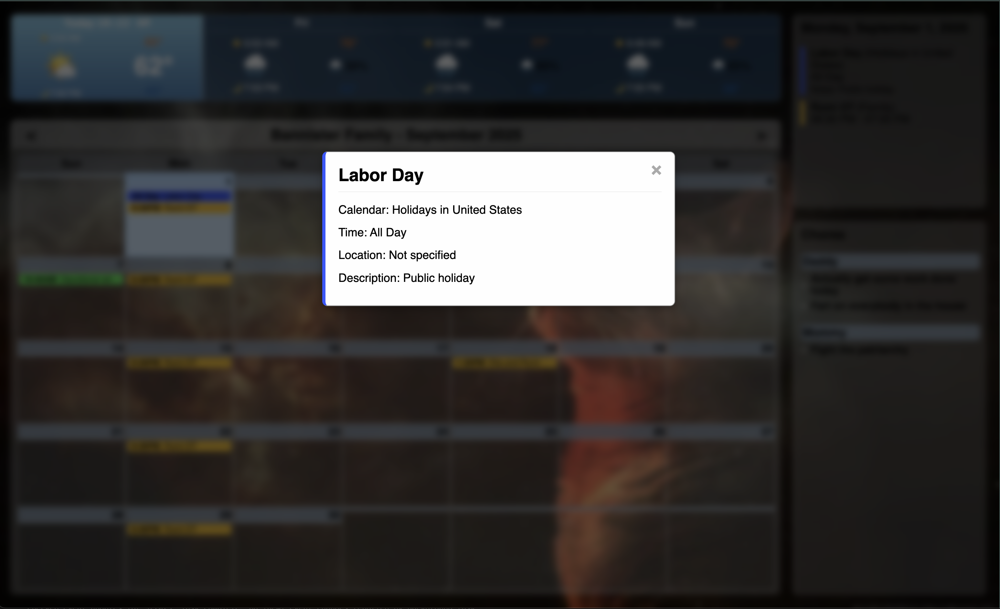

# Family Calendar & Photo Slideshow

A wall-mounted family calendar and photo slideshow for a Raspberry Pi with a
touchscreen. Google Calendar and Google Tasks on a glass UI over an always-on
photo slideshow, with weather, a PIR motion sensor that wakes the screen, and
phone photo uploads over a QR code.




## Features

- **Monthly calendar** with colour-coded events from any number of Google
  Calendars, a day panel for the selected date, swipe between months, jump
  to any month, and a "Today" button.
- **Chores** synced with Google Tasks: tap to complete, swipe to dismiss, add
  new chores with an on-screen keyboard.
- **Weather**: current conditions and a three-day forecast from Open-Meteo,
  cached so the display keeps working offline.
- **Always-on slideshow** behind the UI: slow pan-and-zoom on every photo,
  crossfades, portrait photos shown whole over a blurred backdrop instead of
  cropped, every photo shown once before any repeats.
- **Presence-aware display**: after a configurable idle time the screen dims,
  then the UI fades away and only the photos remain. A touch or the PIR
  sensor brings it back instantly. Separate day and night timings and
  brightness, with real backlight control where the hardware supports it.
- **Phone uploads**: a QR code opens a time-limited upload page; HEIC from
  iPhones is converted, orientation is fixed, photos are resized for the
  display.
- **Self-service upgrades** from the settings panel, plus health and
  diagnostics endpoints.

## How it works

The Flask backend on the Pi owns the display state. It watches the PIR
sensor, the clock, and the touches the page reports, decides whether the
screen should be active, dimmed or showing the slideshow, sets the backlight,
and pushes the decision to the browser over a server-sent event stream. The
browser is a Svelte single-page app that renders that state. See
[docs/ARCHITECTURE.md](docs/ARCHITECTURE.md).

## Installation on a Raspberry Pi

Hardware: Raspberry Pi 4 or 5 running Raspberry Pi OS Bookworm (64-bit), a
touchscreen, and an HC-SR501 PIR sensor wired VCC to 5V (pin 2 or 4), GND to
pin 6, OUT to GPIO 18 (pin 12).

```bash
git clone https://github.com/Rasheed-bannister/family_calendar.git
cd family_calendar
sudo ./deploy_raspberry_pi.sh
```

The script installs the system packages (Python, Node.js, Chromium, lgpio,
ddcutil), builds the backend and frontend, writes `config.json`, sets up GPIO
and backlight permissions, installs the `family-calendar` systemd service,
configures the kiosk browser to start with the desktop, and turns screen
blanking off. It is safe to re-run.

Google sync needs OAuth credentials: create a project in the
[Google Cloud Console](https://console.cloud.google.com/), enable the
Calendar and Tasks APIs, create OAuth credentials of type *Desktop
application*, and save the download as
`src/google_integration/credentials.json`. The first sync opens a browser
window to authorise the account.

### Checking the install

```bash
curl -s localhost:5000/health/ | python3 -m json.tool     # status, hardware.pir, hardware.display
curl -s localhost:5000/pir/status                         # {"available": true, ...} when the sensor works
sudo systemctl stop family-calendar && .venv/bin/python scripts/pir_smoke_test.py
```

The settings panel (gear, bottom-left of the display) shows the same
information and can run the full diagnostics.

### Upgrading

Use **Check for updates** in the settings panel, or on the Pi:

```bash
./upgrade.sh
```

Both back up your data, check out the release, rebuild, and restart.

## Configuration

`config.json` (copied from `config.default.json` on first run). The parts
you are most likely to touch:

```json
{
  "app": { "family_name": "Family", "timezone": null },
  "weather": { "latitude": 40.759, "longitude": -73.984, "timezone": "America/New_York" },
  "pir_sensor": { "enabled": true, "gpio_pin": 18, "debounce_time": 2.0, "simulation_mode": false },
  "display": {
    "day":   { "dim_after_seconds": 3600, "hide_ui_after_seconds": 3605, "brightness": 0.6 },
    "night": { "dim_after_seconds": 5,    "hide_ui_after_seconds": 10,   "brightness": 0.2 },
    "night_start_hour": 21,
    "night_end_hour": 6,
    "backlight": { "backend": "auto", "device": null }
  },
  "slideshow": { "interval_seconds": 30, "transition_seconds": 2, "ken_burns": true, "max_dimension": 2048 }
}
```

- `display.*.dim_after_seconds` / `hide_ui_after_seconds`: idle time before
  the screen dims and before the UI hides. `brightness` is the backlight
  level while idle (0 to 1).
- `display.backlight.backend`: `auto` picks a sysfs backlight (the official
  touchscreen) or `ddcutil` (HDMI monitors with DDC/CI); `none` dims with a
  translucent overlay in the browser instead. With `none`, a low night
  brightness makes the photos very dark, so consider `0.5` or so.
- An older `inactivity` section is migrated to `display` automatically.
- Environment variables `CALENDAR_WEATHER_LATITUDE`, `CALENDAR_WEATHER_LONGITUDE`,
  `CALENDAR_TIMEZONE`, `CALENDAR_PORT`, `CALENDAR_DEBUG`, `CALENDAR_ENV`
  override the file.

### Photos

Tap **📱 Photos** on the display and scan the QR code with a phone, or copy
files into `src/static/photos/`. Either way the app processes them into
display-sized variants (`src/static/photos/processed/`) on the next scan.
JPG, PNG, HEIC, WebP and GIF are accepted, up to 16MB each. Upload links
expire after 60 minutes and are rate limited.

## Development

```bash
uv sync                                  # Python 3.11+, creates .venv
uv run python -m src.main                # backend on http://localhost:5000

cd frontend && npm ci && npm run dev     # Svelte app on http://localhost:5173, proxied to :5000
npm run build                            # compile into src/static/app/ for Flask to serve

uv run pytest                            # backend tests
cd frontend && npm run check && npm test # frontend type-check and unit tests
npm run smoke                            # Playwright end-to-end run against a live server
```

On a machine without GPIO the sensor reports "not working" in the log, on
`/pir/status`, `/health/` and the on-screen badge. Set
`pir_sensor.simulation_mode` to `true` to silence that in development; the
settings panel's **Test motion** button (debug mode) feeds a fake event
through the same path.

## Repository layout

```
src/            Flask backend (display/, pir_sensor/, calendar_app/, chores_app/, slideshow/, ...)
frontend/       Svelte 5 + TypeScript app, built by Vite into src/static/app/
tests/          pytest suite
startup/        systemd unit, kiosk launcher, udev rule, health monitor
scripts/        PIR smoke test and diagnostics
docs/           architecture notes
```

## License

Open source; see the repository for details.
